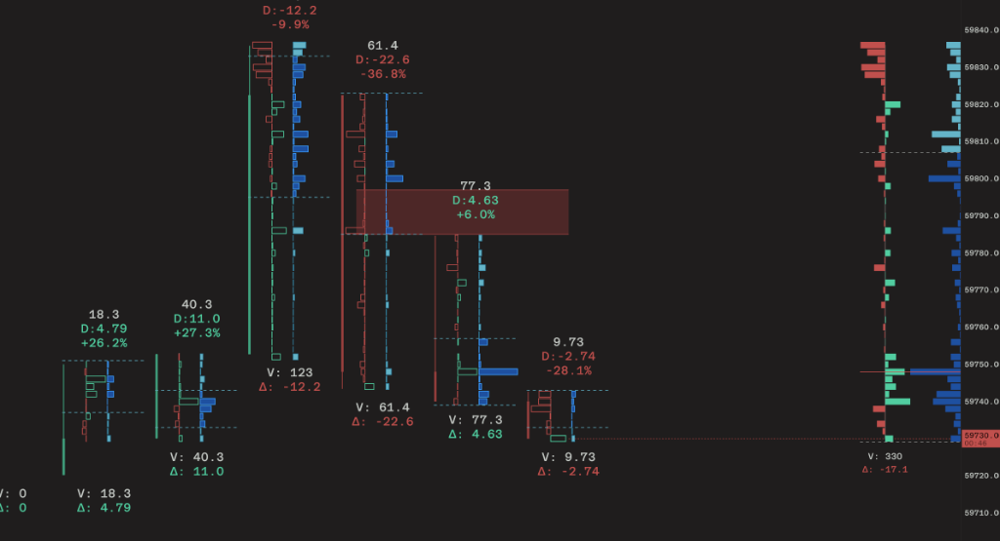

# U3 Crypto Orderflow

U3 Crypto Orderflow is an advanced, high-performance charting and orderflow analysis platform designed specifically for cryptocurrency trading. Built entirely in Rust, it delivers a deeply optimized, latency-sensitive experience that empowers institutional and retail traders with precise market microstructure insights.



## Core Features

### Advanced Orderflow Visualization
- **Footprint Charts & Imbalances**: Analyze bid/ask volume distribution at specific price levels to identify stacked imbalances and institutional footprints.
- **Delta & Volume Profiles**: Real-time tracking of buying and selling pressure. Integrated Session Delta Profile and Volume Profile precisely aligned to provide structural context for the trading session.
- **CVD (Cumulative Volume Delta) Divergence**: Automated detection of price and CVD divergences, providing visual cues for potential trend reversals directly on the chart.
- **Dynamic VWAP**: Real-time Volume Weighted Average Price calculation for accurate baseline assessment.

### High-Performance Architecture
- **Rust Native**: Leverages Rust's memory safety and concurrency to handle massive amounts of real-time tick data with minimal overhead.
- **Hardware Acceleration**: Built on top of iced and wgpu to render thousands of dynamic UI elements and chart primitives efficiently.
- **Streamlined Workflow**: Intuitive drawing tools with intelligent snapping, hit-testing, and rapid deletion functions designed for fast-paced trading environments.

### Exchange Integration
Seamlessly connects with major cryptocurrency exchanges for real-time tick, trade, and depth data:
- Binance
- Bybit
- Hyperliquid
- OKX
- MEXC

## Getting Started

Ensure you have the latest stable version of Rust and Cargo installed.

```bash
# Clone the repository
git clone https://github.com/U38572331/U3_OrderFlow.git
cd U3_OrderFlow

# Build and run the platform in release mode for optimal performance
cargo run --release
```

## Disclaimer
This software is provided for educational and analytical purposes only. It does not constitute financial advice. Cryptocurrency trading involves substantial risk.
